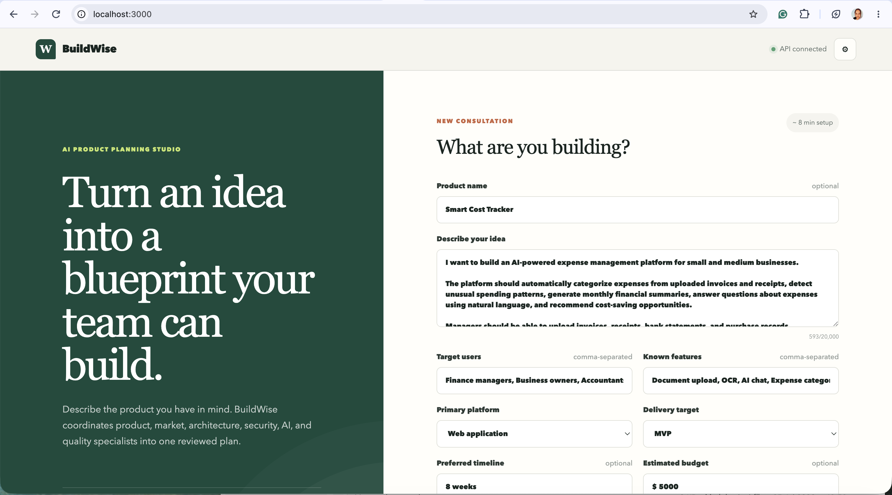
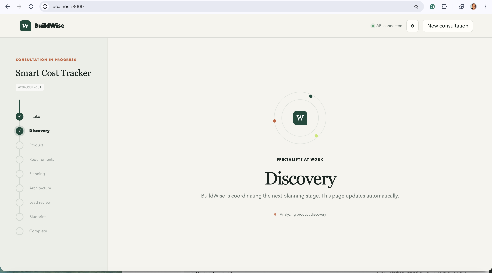

# BuildWise AI

> Transform vague product ideas into reviewed, implementation-ready product blueprints.

BuildWise AI is a CrewAI-powered product consulting board. It combines
human-in-the-loop discovery, deterministic specialist routing, focused planning
Crews, project-cost aggregation, Lead Review, bounded revisions, guardrails,
and deterministic report generation.





## What it produces

A completed consultation contains 17 structured sections covering:

- Product vision, users, features, scope, and requirements
- User journeys, market context, and go-to-market guidance
- Solution, AI, security, and QA architectures when applicable
- Roadmap and directional project-cost estimates
- Risks, assumptions, open questions, implementation guidance, and limitations

The final blueprint is available as typed JSON in the API and downloadable
Markdown in the frontend.

## Current workflow

```text
Frontend intake
  → API validation, rate limits, and input guardrail
  → Discovery and optional clarification loop
  → Product Planning Crew
  → Deterministic Specialist Planner
  → Technical Planning Crew
  → Project Cost Aggregator
  → Lead Review
      → targeted bounded revisions, or
      → deterministic blueprint assembly
  → final typed/Markdown validation
  → filesystem or S3 report storage
  → frontend blueprint viewer and download
```

See [Current end-to-end implementation flow](docs/current_end_to_end_flow.md)
for the complete browser-to-report lifecycle.

## Main capabilities

- Typed FastAPI consultation, clarification, status, and result endpoints
- Durable PostgreSQL Flow state and versioned artifacts
- Human clarification with pause, persistence, and resume
- Dynamic AI, Security, QA, and early Market & GTM selection
- Deterministic dependency-aware revision routing
- Separate project-cost and LLM-usage aggregation
- Input and external-tool prompt-injection boundaries
- Runtime token, cost, agent, tool, retry, and duration limits
- Pre-assembly and post-assembly output validation
- Local filesystem report storage with optional S3 storage
- Process-local API throttling and active-consultation limits
- GitHub Actions quality, test, Docker, dependency, secret, and image checks

## Specialist roles

- Discovery Analyst
- Product Manager
- Business Analyst
- Market & GTM Strategist
- Solution Architect
- AI Architect
- Security Architect
- QA and Evaluation Architect
- Lead Reviewer

The Specialist Planner, cost aggregators, validators, budget controller,
revision router, Blueprint Assembler, and Markdown Renderer are deterministic
application components—not additional Agents.

## Technology

- Python 3.12
- FastAPI
- CrewAI 1.15.5
- Pydantic 2
- SQLAlchemy and PostgreSQL
- React 19 and TypeScript
- Docker and Docker Compose
- S3-compatible object storage
- Structlog
- GitHub Actions

## Quick start

Prerequisites: `uv`, Python 3.12, Docker with Compose, Node.js 22.13 or newer,
and npm.

```bash
uv python install 3.12
uv sync --frozen
cp .env.example .env
```

Add at least an OpenAI key to `.env`:

```env
OPENAI_API_KEY=your-openai-api-key
```

`SERPER_API_KEY` is optional and enables live market/competitor research.

Start PostgreSQL and the backend:

```bash
docker compose up -d postgres
uv run uvicorn buildwise.main:app --reload --host 0.0.0.0 --port 8080
```

In another terminal, start the frontend:

```bash
cd web
npm install
npm run dev
```

Open:

- Frontend: [http://localhost:3000](http://localhost:3000)
- API docs: [http://localhost:8080/docs](http://localhost:8080/docs)
- Health: [http://localhost:8080/health](http://localhost:8080/health)
- Readiness: [http://localhost:8080/ready](http://localhost:8080/ready)

For complete local, Docker, PostgreSQL, S3, API, test, coverage, lint, type
check, frontend, CI-equivalent, logs, and cleanup commands, use
[Setup and testing commands](docs/setup_testing_commands.md).

## Report storage

Local development defaults to:

```text
data/reports/{consultation_id}/blueprint.md
```

S3 uses:

```text
consultations/{consultation_id}/blueprints/v1/blueprint.md
```

Optional JSON storage uses the matching `blueprint.json` path. PostgreSQL
stores report version, key/path, generation time, and Lead Review ID.

## Runtime boundaries

- The MVP has no authentication or tenant isolation.
- Background execution uses in-process FastAPI tasks.
- API and active-session limits are process-local.
- Multiple workers require shared rate limiting and durable job coordination.
- Provider/model fallback is not implemented.
- Blueprint comparison and update workflows are not implemented.
- Estimated LLM cost remains `null` when provider metadata is unreliable.

## Documentation

- [Current end-to-end implementation flow](docs/current_end_to_end_flow.md)
- [Latency incident and responsive AI workflow article](docs/articles/from-two-minute-waits-to-responsive-ai-workflows.md)
- [Setup and testing commands](docs/setup_testing_commands.md)
- [Processor and classifier catalog](<docs/architecture/2. buildwise_processors_classifiers_catalog.md>)
- [Model selection analysis](<docs/architecture/3. llm_model_selection.md>)

## Project structure

```text
src/buildwise/
├── agents/          Agent contracts and CrewAI Agent factory
├── api/             FastAPI routes, service layer, and rate limiting
├── application/     Cost, usage, budget, guardrail, and error services
├── crews/           Focused Crew factories and output assembly
├── domain/          Typed business and runtime models
├── flows/           Main Flow, routing, state, and revisions
├── persistence/     PostgreSQL repositories and Flow persistence
├── planning/        Deterministic specialist planning
├── reporting/       Blueprint assembly, Markdown, filesystem, and S3
├── security/        Shared content scanning and secret redaction
├── tasks/           CrewAI Tasks and task guardrails
├── tools/           Tool registry, execution policies, and sanitization
└── validation/      Pre-assembly and final-output validation

web/                 Browser frontend
tests/               Unit and integration tests
docs/                Architecture and operating documentation
```
