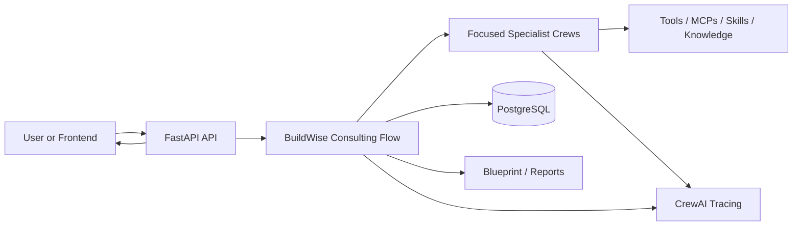
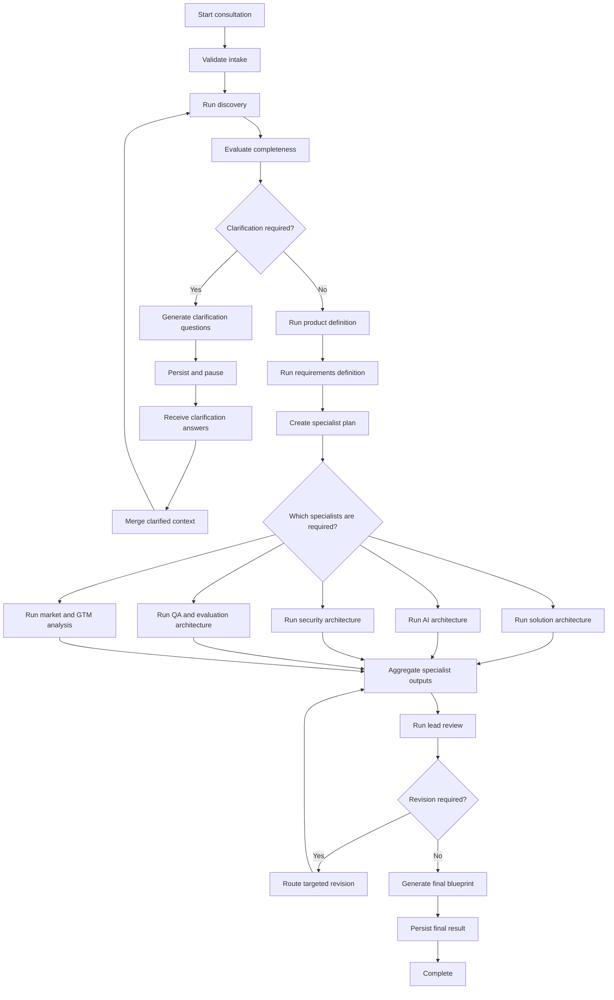

# BuildWise AI — CrewAI Runtime Architecture Contract

**File:** `docs/architecture/crewai_runtime_architecture.md`  
**Status:** Accepted  
**Version:** 1.0  
**Last updated:** 2026-07-26  
**Primary framework:** CrewAI `1.15.5`  
**Architecture style:** Flow-first, CrewAI-native modular monolith

---

## 1. Purpose

This document is the implementation contract for the BuildWise AI runtime.

BuildWise AI is a CrewAI-powered product consulting board that transforms a vague product idea into a structured, build-ready blueprint through a sequence of specialist analysis stages.

This contract ensures that the implementation remains:

- CrewAI-native
- production-minded
- lean enough to build within two to four days
- explicit about state, routing, validation, persistence, and human input
- free from unnecessary orchestration abstractions
- consistent across FastAPI, CrewAI Flows, Crews, agents, tools, skills, and persistence

All future runtime code must conform to the responsibilities, boundaries, and folder ownership defined here.

---

## 2. Architecture Principles

### 2.1 Flow-first orchestration

CrewAI Flows are the primary application runtime.

Flows own:

- execution order
- shared runtime state
- deterministic routing
- pause and resume behavior
- human clarification
- specialist selection
- conditional execution
- retry boundaries
- final result assembly
- runtime lifecycle events

FastAPI starts or resumes Flows. It does not orchestrate agents directly.

### 2.2 Crews are focused reasoning units

A Crew represents a focused unit of collaborative AI work.

A Crew must:

- have one clearly defined business outcome
- contain only agents required for that outcome
- use explicit tasks with clear inputs and outputs
- return structured Pydantic output
- avoid owning cross-stage orchestration
- avoid becoming a general-purpose consulting team

### 2.3 Agents are specialists

Each agent must have a distinct professional responsibility.

Agents must not:

- duplicate another agent's primary responsibility
- make application-level routing decisions
- persist application state directly
- invoke unrestricted tools
- act as an all-purpose expert
- produce unstructured output where a domain model exists

### 2.4 Tasks receive most of the design effort

Task design is treated as the main quality lever.

Every task must define:

- purpose
- inputs
- scope
- constraints
- required reasoning
- expected output
- output schema
- validation or guardrails
- required context from previous tasks

Tasks should have a single clear purpose and a single primary output.

### 2.5 Structured outputs are mandatory

All stage outputs passed between Crews, Flows, persistence, and the API must use Pydantic models.

Preferred CrewAI mechanisms:

- `output_pydantic`
- `output_json` only when Pydantic output is not practical
- task guardrails
- explicit task context
- typed Flow state

Manual JSON extraction, regex parsing, or free-form inter-stage contracts are not permitted.

### 2.6 Deterministic code owns control decisions where possible

Python logic should handle decisions that can be made deterministically.

Examples:

- whether required intake fields are present
- whether completeness is below a threshold
- whether clarification questions exist
- whether a specialist is required from a known classification
- whether cost or execution limits are exceeded
- whether a review result requests revision
- which stage follows another stage

LLM routing should only be used where semantic classification is genuinely required.

### 2.7 Start sequentially

Crews use the sequential process by default.

Hierarchical execution is allowed only when:

- the work cannot be expressed clearly as sequential tasks
- delegation adds measurable value
- the manager role has a distinct responsibility
- the additional latency and cost are justified

The MVP will not use hierarchical crews unless explicitly approved in a later architecture decision.

### 2.8 Lean production engineering

BuildWise must include practical production controls without becoming a platform project.

Required controls:

- structured validation
- bounded retries
- model and execution timeouts
- request correlation
- structured logging
- CrewAI tracing
- cost and token tracking
- rate limits
- controlled tool access
- human-in-the-loop
- persistence
- Docker
- CI

Not part of the MVP:

- a custom workflow engine
- a custom agent framework
- a generic evaluation platform
- a generic observability platform
- a generic prompt-management platform
- a generic policy engine
- a separate event-streaming platform
- microservices
- Kafka
- Kubernetes

---

## 3. System Context



### 3.1 Primary runtime path

```text
Frontend or API client
    ↓
FastAPI router
    ↓
ConsultingFlow
    ↓
Focused Crew execution
    ↓
Structured Pydantic artifacts
    ↓
Flow state update
    ↓
PostgreSQL persistence
    ↓
Review and final blueprint
    ↓
API status, stream, or result response
```

---

## 4. Runtime Boundaries

### 4.1 FastAPI responsibilities

FastAPI owns transport concerns.

FastAPI must:

- validate HTTP request bodies
- authenticate and authorize callers when identity is introduced
- create consulting sessions
- start a new Flow execution
- resume a paused Flow
- expose session status
- expose clarification questions
- accept clarification answers
- expose final artifacts
- stream runtime events to the frontend
- map domain errors to HTTP responses
- provide health and readiness endpoints

FastAPI must not:

- define agent prompts
- perform consulting reasoning
- call specialist agents directly
- decide specialist execution order
- merge specialist outputs manually
- contain workflow routing logic
- mutate Flow state outside approved runtime adapters

### 4.2 Flow responsibilities

The Flow is the application runtime.

The Flow owns:

- intake initialization
- session correlation
- state transitions
- Crew execution order
- conditional specialist routing
- completeness routing
- clarification pause and resume
- review revision loops
- runtime budgets
- stage-level failure handling
- runtime result aggregation
- final blueprint completion
- final persistence coordination
- Flow event streaming
- full-run token usage collection

### 4.3 Crew responsibilities

A Crew owns a focused reasoning outcome.

Each Crew:

- receives explicit inputs from Flow state
- executes a small number of focused tasks
- returns a structured artifact
- uses only approved agents
- uses only approved tools, skills, and knowledge
- does not update PostgreSQL directly
- does not control the broader Flow
- does not invoke unrelated Crews

### 4.4 Domain responsibilities

The domain package owns stable business contracts.

Domain models are used as:

- API request and response models
- Crew structured outputs
- Flow state artifacts
- persistence serialization contracts
- reporting inputs
- validation contracts

The domain layer must not import FastAPI or CrewAI runtime objects.

### 4.5 Persistence responsibilities

PostgreSQL is the business system of record.

It stores:

- consulting sessions
- current session status
- current session stage
- intake artifacts
- clarification questions and answers
- discovery outputs
- product definitions
- requirements
- architecture artifacts
- AI architecture artifacts
- security artifacts
- QA and evaluation artifacts
- review outcomes
- final blueprints
- usage and cost summaries
- runtime error summaries

CrewAI Flow persistence is used for runtime continuation and recovery.

| Concern | Owner |
|---|---|
| Business artifacts and API-visible session state | PostgreSQL |
| Flow execution snapshot and resume state | CrewAI Flow persistence |
| Crew task checkpointing | Optional CrewAI checkpointing |
| Long-term product record | PostgreSQL |

For the MVP, Flow persistence should use the simplest reliable CrewAI-supported backend. PostgreSQL remains the source of truth exposed to the application.

### 4.6 Observability responsibilities

| Signal | Responsibility |
|---|---|
| Crew and Flow traces | CrewAI tracing |
| Request and application events | Structlog |
| Session usage and cost ledger | PostgreSQL |
| Health and readiness | FastAPI |
| Correlation ID | Request middleware and Flow state |
| Stage timing | Flow lifecycle instrumentation |
| Tool execution | CrewAI events and safe structured logs |

---

## 5. Canonical End-to-End Consulting Flow



---

## 6. Flow Stages

### 6.1 Intake validation

Purpose:

- validate the incoming product idea
- normalize supported metadata
- initialize session and runtime limits
- reject structurally invalid requests before LLM use

Owner:

- FastAPI request validation
- deterministic Flow initialization

No Crew is required for basic structural validation.

### 6.2 Discovery

Purpose:

- interpret the idea
- identify known facts
- record assumptions
- identify unknowns
- classify the product
- identify risks
- evaluate completeness
- generate clarification questions when needed

Output:

- `DiscoveryResult`
- `CompletenessResult`
- `ClarificationQuestionSet`

Primary agent:

- Discovery Analyst

### 6.3 Human clarification

Purpose:

- pause execution when critical context is missing
- expose clarification questions through the API
- collect user answers
- merge answers into product context
- resume the same consulting session

The Flow owns pause and resume behavior.

The Discovery Crew owns question quality, not runtime suspension.

### 6.4 Product definition

Purpose:

- define the product goal
- define target users and personas
- define MVP scope
- define product features
- define risks and roadmap
- establish acceptance-level product clarity

Primary agent:

- Product Manager

Supporting agent:

- Business Analyst where requirement preparation is needed

### 6.5 Requirements definition

Purpose:

- produce functional requirements
- produce non-functional requirements
- define business rules
- define data requirements
- define user journeys and stories
- create traceability between product features and requirements

Primary agent:

- Business Analyst

### 6.6 Specialist planning

Purpose:

- decide which conditional specialists are required
- define execution order
- avoid unnecessary model calls
- enforce cost, token, and execution budgets

Always included:

- Solution Architect
- Market and GTM Strategist
- Lead Reviewer

Conditional:

- AI Architect
- Security Architect
- QA and Evaluation Architect

The specialist plan is derived from validated classification and requirements.

### 6.7 Specialist execution

Each specialist produces one structured artifact.

Specialist outputs are independent artifacts and are not merged by the agents themselves.

The Flow aggregates them before review.

### 6.8 Lead review

Purpose:

- inspect all upstream artifacts
- detect contradictions
- detect missing traceability
- detect unsupported assumptions
- identify architecture or scope gaps
- approve, approve with limitations, request targeted revision, or block completion

The Lead Reviewer must not silently rewrite every specialist output.

It must identify targeted revision ownership.

### 6.9 Final blueprint

Purpose:

- assemble approved structured artifacts
- include limitations and assumptions
- produce machine-readable and human-readable outputs
- persist the final blueprint
- mark the session complete

---

## 7. Crew Design

### 7.1 Discovery Crew

**Outcome:** Produce a validated understanding of the product idea and determine whether human clarification is required.

**Agents:** Discovery Analyst

**Tasks:**

1. Interpret and classify the product idea.
2. Evaluate completeness and risks.
3. Generate prioritized clarification questions when necessary.

**Process:** Sequential.

**Structured outputs:**

- `DiscoveryResult`
- `CompletenessResult`
- `ClarificationQuestionSet`

**Tools:** None by default.

External research is not used during initial discovery unless the product idea explicitly requires factual verification.

### 7.2 Product Definition Crew

**Outcome:** Produce a coherent product definition and MVP scope.

**Agents:**

- Product Manager
- Business Analyst

**Tasks:**

1. Define product goals, users, scope, features, risks, and roadmap.
2. Validate product scope against clarified context.
3. Prepare business context required for requirements definition.

**Process:** Sequential.

**Structured output:** `ProductDefinition`

**Tools:** None by default.

**Skills:**

- product management
- MVP scoping
- product risk analysis

### 7.3 Requirements Crew

**Outcome:** Transform product definition into traceable, implementation-ready requirements.

**Agents:** Business Analyst

**Tasks:**

1. Produce functional requirements.
2. Produce non-functional requirements.
3. Produce business rules, data requirements, edge cases, user stories, and journeys.
4. Validate requirement traceability and completeness.

**Process:** Sequential.

**Structured output:** `RequirementsSpecification`

**Tools:** None by default.

**Skills:**

- business analysis
- requirements engineering
- acceptance criteria
- traceability

### 7.4 Market and GTM Crew

**Outcome:** Produce practical market positioning and go-to-market guidance.

**Agents:** Market and GTM Strategist

**Tasks:**

1. Identify target market and category.
2. Assess competitors and substitutes when research is justified.
3. Define positioning, differentiation, channels, and launch assumptions.
4. Identify evidence gaps and confidence levels.

**Process:** Sequential.

**Structured output:** A dedicated market and GTM artifact to be defined in the domain layer.

**Conditional tools:**

- `SerperDevTool`
- `ScrapeWebsiteTool`

**Tool policy:**

- research only when market evidence is required
- prefer primary or authoritative sources
- return source metadata
- no unrestricted browsing loop
- bounded tool calls

### 7.5 Solution Architecture Crew

**Outcome:** Produce the canonical solution architecture.

**Agents:** Solution Architect

**Tasks:**

1. Map requirements to logical components.
2. Define connections and data flows.
3. Select technologies.
4. Define deployment units.
5. Document architecture decisions.
6. Define scalability and observability requirements.
7. Identify architecture risks and costs.

**Process:** Sequential.

**Structured output:** `SolutionArchitecture`

**Skills:**

- solution architecture
- modular monolith design
- deployment design
- observability
- cost-aware architecture

**Tools:** None by default.

### 7.6 AI Architecture Crew

**Activation:** Conditional.

Run when the product includes one or more of:

- LLM generation
- agentic workflows
- RAG
- semantic search
- AI classification
- AI extraction
- model routing
- AI evaluation
- AI guardrails
- tool-using agents
- multimodal AI

**Agents:** AI Architect

**Outcome:** Produce a practical AI architecture aligned with CrewAI capabilities and product constraints.

**Structured output:** `AIArchitecture`

**Skills:**

- agent architecture
- model selection
- prompting
- structured output
- RAG design
- guardrails
- AI evaluation
- AI security boundaries

**Tools:** No external tools by default.

### 7.7 Security Architecture Crew

**Activation:** Conditional.

Run when the product includes:

- authentication or authorization
- sensitive data
- regulated data
- payments
- external integrations
- public tool execution
- AI agents with side effects
- privileged operations
- multi-tenant data
- compliance requirements

**Agents:** Security Architect

**Outcome:** Produce security controls, trust boundaries, threat considerations, secrets handling, access controls, and AI-specific security requirements.

**Structured output:** A dedicated security architecture artifact to be defined in the domain layer.

**Skills:**

- application security
- cloud security
- AI security
- secure tool use
- threat modeling

### 7.8 QA and Evaluation Crew

**Activation:** Conditional.

Run when the product has:

- AI-generated user-visible output
- complex business rules
- high-risk workflows
- structured-output reliability requirements
- retrieval or agent evaluation needs
- material regression risk

**Agents:** QA and Evaluation Architect

**Outcome:** Produce software testing and AI evaluation strategy.

**Structured output:** A dedicated QA and evaluation artifact to be defined in the domain layer.

**Skills:**

- test strategy
- acceptance testing
- integration testing
- AI evaluation
- regression evaluation
- safety testing

### 7.9 Lead Review Crew

**Outcome:** Approve the blueprint or request targeted revisions.

**Agents:** Lead Reviewer

**Tasks:**

1. Review product and requirement consistency.
2. Review requirement-to-architecture traceability.
3. Review specialist contradictions.
4. Review risk, cost, scope, and feasibility.
5. Issue a structured review decision.

**Process:** Sequential.

**Structured output:** A dedicated review artifact with:

- decision
- findings
- severity
- affected artifact
- revision owner
- revision request
- limitations
- approval rationale

**Tools:** None.

**Model tier:** Strongest approved reasoning model.

---

## 8. Agent Responsibility Matrix

| Agent | Primary ownership | Must not own | Default tools | Primary skills | Model tier |
|---|---|---|---|---|---|
| Discovery Analyst | idea interpretation, classification, completeness, clarification | product roadmap, architecture, final approval | none | discovery analysis, clarification design | fast or primary |
| Product Manager | product goal, personas, MVP scope, features, roadmap | system architecture, AI design, security review | none | product management, MVP scoping | primary |
| Business Analyst | requirements, business rules, data requirements, user journeys, traceability | technology selection, deployment design | none | requirements engineering | primary |
| Market and GTM Strategist | market framing, positioning, channels, evidence-backed competition analysis | internal architecture, security controls | search and scraping when approved | market research, GTM | primary |
| Solution Architect | components, integrations, technology choices, deployment, scalability, observability | detailed prompt design, detailed AI evaluation, final approval | none by default | solution architecture | architect |
| AI Architect | model strategy, agents, tools, prompts, RAG, guardrails, AI evaluation | general product scope, security sign-off, final approval | none by default | AI architecture | architect |
| Security Architect | threats, trust boundaries, access, secrets, AI security controls | product roadmap, final approval | none by default | security architecture | architect |
| QA and Evaluation Architect | software testing and AI evaluation strategy | product ownership, technology ownership | none by default | QA, AI evaluation | primary or architect |
| Lead Reviewer | cross-artifact review, approval, targeted revision routing | silently replacing specialist ownership | none | architecture review, product review | strongest reviewer |

---

## 9. CrewAI Capability Policy

### 9.1 Action capabilities

#### Tools

Use for local callable actions such as:

- web search
- website scraping
- GitHub search
- file access
- controlled application functions

#### MCP

Use when a capability is hosted as an external tool server.

MCP is not required for the MVP unless a concrete external integration needs it.

#### Apps

Not part of the initial BuildWise MVP.

They may be used later for integrations such as Gmail, Slack, Jira, or Google Drive.

### 9.2 Context capabilities

#### Skills

Skills provide methodology, procedures, checklists, and role-specific instructions.

Examples:

- product management process
- architecture review checklist
- security review methodology
- requirements-writing guidelines
- AI architecture methodology

Skills should not contain frequently changing factual data.

#### Knowledge

Knowledge provides reusable facts, standards, templates, and reference documents.

Examples:

- product blueprint template
- architecture principles
- non-functional requirement catalog
- internal delivery standards
- AI risk taxonomy
- security reference material

Knowledge should not be used as a replacement for application state.

---

## 10. Tool Governance

Every tool must be explicitly approved for an agent or task.

A tool definition must include:

- purpose
- allowed users
- allowed operations
- input constraints
- output schema
- timeout
- retry policy
- rate limit
- side-effect classification
- sensitive-data policy
- logging policy
- failure behavior

### 10.1 Default-deny policy

Agents receive no tools unless a task requires them.

### 10.2 Read versus write tools

Read-only tools are preferred.

Write or side-effect tools require:

- explicit task authorization
- least-privilege credentials
- human approval when impact is material
- idempotency where applicable
- audit logging
- bounded execution

### 10.3 Tool limits

The runtime enforces:

- maximum tool calls per session
- timeout per tool call
- bounded retries
- safe argument logging
- redaction of secrets and sensitive content
- rate limiting

---

## 11. Model Strategy

The runtime supports named model roles rather than hard-coding models throughout the codebase.

Required configuration roles:

- `FAST_MODEL`
- `PRIMARY_AGENT_MODEL`
- `ARCHITECT_MODEL`
- `LEAD_REVIEWER_MODEL`

| Work type | Model role |
|---|---|
| classification and simple extraction | fast |
| product and business analysis | primary |
| architecture and AI architecture | architect |
| final cross-artifact review | lead reviewer |

Provider-specific model names remain configuration values.

No domain model or Flow should depend on a provider-specific class.

---

## 12. Structured Flow State

The Flow uses a minimal, typed Pydantic state.

The state stores identifiers and cross-stage artifacts required for continuation. It should not become a database mirror.

```python
class BuildWiseFlowState(BaseModel):
    session_id: UUID
    request_id: UUID | None = None
    correlation_id: str | None = None

    status: SessionStatus
    stage: SessionStage

    intake: ProductIdeaRequest | None = None
    product_context: ProductIdeaContext | None = None

    discovery: DiscoveryResult | None = None
    completeness: CompletenessResult | None = None
    clarification_questions: ClarificationQuestionSet | None = None
    clarification_answers: list[ClarificationAnswer] = []

    product_definition: ProductDefinition | None = None
    requirements: RequirementsSpecification | None = None

    specialist_plan: SpecialistPlan | None = None

    solution_architecture: SolutionArchitecture | None = None
    ai_architecture: AIArchitecture | None = None
    security_architecture: SecurityArchitecture | None = None
    qa_evaluation_architecture: QAEvaluationArchitecture | None = None
    market_gtm_strategy: MarketGTMStrategy | None = None

    review: BlueprintReview | None = None
    blueprint: ProductBlueprint | None = None

    revision_count: int = 0
    completed_specialists: set[SpecialistType] = set()

    usage: RuntimeUsage = RuntimeUsage()
    error: SessionError | None = None
```

The exact model names may evolve as Phase 1 domain work continues, but the ownership and minimal-state principle are fixed.

---

## 13. Flow Routing Rules

### 13.1 Clarification routing

Clarification is required when one or more critical unknowns prevent a reliable downstream artifact.

Examples:

- target user is unknown
- product goal is contradictory
- core workflow is missing
- deployment context materially affects the solution
- required integrations are unknown
- regulated or sensitive data is implied but not clarified
- AI is requested without a clear capability or data source

The Discovery Crew proposes clarification questions.

The Flow decides whether to pause based on the structured completeness result.

### 13.2 AI Architect routing

Run the AI Architect when `CapabilityClassification` contains an AI-relevant capability.

Do not run the AI Architect only because the product name contains “AI”.

### 13.3 Security routing

Run the Security Architect when structured classifications or requirements indicate meaningful security risk.

Basic security considerations remain part of solution architecture even when the specialist is not activated.

### 13.4 QA routing

Run the QA and Evaluation Architect when the product has material quality, reliability, safety, or AI evaluation needs.

### 13.5 Revision routing

The Lead Reviewer returns targeted revision requests.

Each revision request identifies:

- artifact
- owner
- reason
- severity
- required changes
- acceptance criteria

The Flow reruns only the affected specialist stage.

The complete pipeline must not restart unless upstream assumptions changed.

---

## 14. Human-in-the-Loop Contract

Human input is required for:

- unresolved discovery questions
- approval of materially risky side effects
- optional approval gates before final blueprint completion
- future manual review workflows

For initial clarification:

```text
Flow discovers missing critical context
    ↓
Flow stores questions
    ↓
Session becomes AWAITING_USER_INPUT
    ↓
API returns clarification questions
    ↓
User submits answers
    ↓
Answers are persisted
    ↓
Flow resumes with the same session
```

The API and PostgreSQL remain the primary user-facing coordination layer.

CrewAI human feedback primitives may be used inside the Flow where they fit the runtime, but the design must support non-blocking API-driven clarification.

---

## 15. Persistence Contract

### 15.1 Session persistence

A consulting session must persist after each major stage.

Major persistence points:

- session created
- discovery completed
- clarification requested
- clarification answered
- product definition completed
- requirements completed
- specialist plan completed
- each specialist artifact completed
- review completed
- final blueprint completed
- terminal failure recorded

### 15.2 Resume

Resume continues the same consulting session and Flow lineage.

The caller uses the existing session identifier.

### 15.3 Fork

Forking a previous session is not required for the MVP.

It may be added later to support generating a revised blueprint from an existing consultation without mutating the source session.

### 15.4 Failure recovery

A failed stage must not erase previously completed artifacts.

The runtime records:

- failed stage
- normalized error category
- retryability
- retry count
- safe error message
- correlation identifier
- last completed stage

---

## 16. Streaming Contract

The frontend should consume CrewAI Flow frame streaming rather than a custom token protocol.

Preferred source:

```python
flow.stream_events(...)
```

The API stream adapter may expose:

- Flow lifecycle frames
- LLM output frames
- tool activity frames
- stage status frames
- progress frames
- final result frame
- controlled error frame

The API must not expose:

- secrets
- raw internal stack traces
- hidden chain-of-thought
- unrestricted tool arguments
- sensitive user data
- provider credentials

The frontend should render stage progress independently from token text.

---

## 17. Validation and Guardrails

| Boundary | Validation |
|---|---|
| HTTP request | FastAPI and Pydantic |
| Flow input | domain validation |
| Task output | CrewAI task guardrail |
| Structured output | `output_pydantic` |
| Cross-artifact consistency | domain and review validation |
| Tool input | tool schema and policy |
| Final blueprint | Lead Reviewer and blueprint validator |

### 17.1 Deterministic guardrails

Use Python guardrails for:

- required fields
- duplicate identifiers
- invalid references
- numeric limits
- unsupported statuses
- traceability checks
- schema validation
- output length or collection limits
- cost and execution budgets

### 17.2 LLM guardrails

Use LLM-based guardrails only for subjective checks such as:

- clarity
- professional quality
- internal coherence
- insufficient justification
- vague recommendations

LLM guardrails do not replace deterministic schema validation.

---

## 18. Reliability Controls

Required runtime controls:

- CrewAI agent `max_iter`
- agent or crew `max_rpm`
- model request timeout
- model retry limit
- task guardrail retry limit
- maximum Flow execution time
- maximum agent executions
- maximum tool calls
- maximum estimated cost
- maximum token budget
- targeted stage retries
- idempotent session updates

A retry must be bounded and must not duplicate completed persistent side effects.

---

## 19. Cost and Usage Tracking

BuildWise tracks cost at the consulting-session level.

The runtime captures:

- prompt tokens
- completion tokens
- cached tokens when available
- reasoning tokens when available
- successful requests
- model used
- agent role
- Crew name
- stage
- tool calls
- estimated cost
- total Flow usage

Use Flow-level usage aggregation for the complete run rather than relying only on the final Crew output.

Budgets from settings:

- maximum session tokens
- maximum estimated session cost
- maximum agent executions
- maximum tool calls

The Flow checks budgets before starting a new expensive stage.

---

## 20. Observability Contract

### 20.1 Correlation

Every session must carry:

- request ID
- session ID
- Flow state ID
- correlation ID
- stage
- Crew name when applicable
- agent role when applicable

### 20.2 Structured logging

Required events include:

- consultation created
- Flow started
- stage started
- Crew started
- Crew completed
- stage completed
- clarification requested
- clarification received
- specialist selected
- specialist skipped
- task validation failed
- retry scheduled
- budget threshold reached
- review revision requested
- Flow completed
- Flow failed

### 20.3 Tracing

CrewAI tracing is the primary execution trace for:

- Flow methods
- Crew execution
- agent steps
- task execution
- LLM calls
- tool calls

Structlog remains the primary application event log.

### 20.4 Sensitive data

Logs and traces must redact:

- API keys
- tokens
- authorization headers
- database credentials
- secrets
- sensitive user content where unnecessary
- raw tool credentials
- unrestricted full prompts where they may contain sensitive data

---

## 21. API Lifecycle

### 21.1 Create consultation

```http
POST /api/v1/consultations
```

Behavior:

1. validate request
2. create session record
3. initialize Flow
4. start execution
5. return either an accepted session response or a streaming response

### 21.2 Read session

```http
GET /api/v1/consultations/{session_id}
```

Returns:

- status
- current stage
- progress
- clarification state
- available artifacts
- usage summary
- safe error summary

### 21.3 Read clarification questions

```http
GET /api/v1/consultations/{session_id}/clarifications
```

### 21.4 Submit clarification answers

```http
POST /api/v1/consultations/{session_id}/clarifications
```

Behavior:

1. validate answers
2. persist answers
3. resume Flow
4. return accepted or streaming response

### 21.5 Read final blueprint

```http
GET /api/v1/consultations/{session_id}/blueprint
```

### 21.6 Stream execution

```http
GET /api/v1/consultations/{session_id}/events
```

The exact streaming transport will be chosen during the API phase. Server-Sent Events are preferred for one-directional runtime progress unless bidirectional transport becomes necessary.

---

## 22. Final Folder Structure

```text
src/buildwise/
├── __init__.py
├── main.py
├── api/
│   ├── __init__.py
│   ├── router.py
│   └── v1/
│       ├── __init__.py
│       ├── router.py
│       ├── consultations.py
│       └── dependencies.py
├── config/
│   ├── __init__.py
│   ├── settings.py
│   └── logging.py
├── domain/
│   ├── __init__.py
│   ├── common.py
│   ├── enums.py
│   ├── errors.py
│   ├── health.py
│   ├── api.py
│   ├── session.py
│   ├── intake.py
│   ├── discovery.py
│   ├── product.py
│   ├── requirements.py
│   ├── architecture.py
│   ├── ai_architecture.py
│   ├── security.py
│   ├── qa_evaluation.py
│   ├── market.py
│   ├── review.py
│   ├── blueprint.py
│   └── usage.py
├── flows/
│   ├── __init__.py
│   ├── state.py
│   ├── consulting_flow.py
│   ├── routing.py
│   ├── persistence.py
│   └── guardrails.py
├── crews/
│   ├── __init__.py
│   ├── shared/
│   │   ├── __init__.py
│   │   ├── loader.py
│   │   └── callbacks.py
│   ├── discovery/
│   │   ├── __init__.py
│   │   ├── crew.jsonc
│   │   └── agents/
│   │       └── discovery_analyst.jsonc
│   ├── product_definition/
│   │   ├── __init__.py
│   │   ├── crew.jsonc
│   │   └── agents/
│   │       ├── product_manager.jsonc
│   │       └── business_analyst.jsonc
│   ├── requirements/
│   │   ├── __init__.py
│   │   ├── crew.jsonc
│   │   └── agents/
│   │       └── business_analyst.jsonc
│   ├── market_gtm/
│   │   ├── __init__.py
│   │   ├── crew.jsonc
│   │   └── agents/
│   │       └── market_gtm_strategist.jsonc
│   ├── solution_architecture/
│   │   ├── __init__.py
│   │   ├── crew.jsonc
│   │   └── agents/
│   │       └── solution_architect.jsonc
│   ├── ai_architecture/
│   │   ├── __init__.py
│   │   ├── crew.jsonc
│   │   └── agents/
│   │       └── ai_architect.jsonc
│   ├── security_architecture/
│   │   ├── __init__.py
│   │   ├── crew.jsonc
│   │   └── agents/
│   │       └── security_architect.jsonc
│   ├── qa_evaluation/
│   │   ├── __init__.py
│   │   ├── crew.jsonc
│   │   └── agents/
│   │       └── qa_evaluation_architect.jsonc
│   └── lead_review/
│       ├── __init__.py
│       ├── crew.jsonc
│       └── agents/
│           └── lead_reviewer.jsonc
├── skills/
│   ├── discovery-analysis/
│   │   └── SKILL.md
│   ├── product-management/
│   │   └── SKILL.md
│   ├── business-analysis/
│   │   └── SKILL.md
│   ├── market-gtm/
│   │   └── SKILL.md
│   ├── solution-architecture/
│   │   └── SKILL.md
│   ├── ai-architecture/
│   │   └── SKILL.md
│   ├── security-architecture/
│   │   └── SKILL.md
│   ├── qa-evaluation/
│   │   └── SKILL.md
│   └── lead-review/
│       └── SKILL.md
├── knowledge/
│   ├── README.md
│   ├── product/
│   ├── requirements/
│   ├── architecture/
│   ├── ai/
│   ├── security/
│   └── evaluation/
├── tools/
│   ├── __init__.py
│   ├── registry.py
│   ├── policies.py
│   └── research/
│       ├── __init__.py
│       └── source_metadata.py
├── persistence/
│   ├── __init__.py
│   ├── database.py
│   ├── models/
│   ├── repositories/
│   └── migrations/
├── observability/
│   ├── __init__.py
│   ├── middleware.py
│   ├── events.py
│   ├── tracing.py
│   └── usage.py
├── validation/
│   ├── __init__.py
│   ├── artifacts.py
│   ├── traceability.py
│   └── budgets.py
├── reporting/
│   ├── __init__.py
│   ├── blueprint.py
│   └── markdown.py
└── infrastructure/
    ├── __init__.py
    ├── llm.py
    └── clock.py
```

---

## 23. Package Ownership Rules

| Package | Ownership |
|---|---|
| `api` | HTTP transport only |
| `config` | Environment and runtime configuration |
| `domain` | Pure business contracts and validation |
| `flows` | Application orchestration and runtime state |
| `crews` | CrewAI JSON-first Crew and agent definitions |
| `skills` | Role methodology and reusable procedures |
| `knowledge` | Reference data and reusable factual material |
| `tools` | Controlled agent actions and tool policy |
| `persistence` | Database models, repositories, and business persistence |
| `observability` | Logging, tracing, event normalization, and usage collection |
| `validation` | Cross-artifact, traceability, and budget validation |
| `reporting` | Human-readable blueprint generation |
| `infrastructure` | Small provider adapters that do not belong to the domain or Flow |

---

## 24. Treatment of Existing Packages

### 24.1 `application/`

The existing `application/` package must not become a parallel orchestration layer.

If it is empty, remove it during the refactor.

If it already contains code, inspect each file before changing it.

| Existing responsibility | Move to |
|---|---|
| workflow orchestration | `flows/` |
| persistence coordination | `persistence/` or a Flow helper |
| request use case | API plus Flow |
| validation | `validation/` |
| reporting | `reporting/` |
| external integration adapter | `infrastructure/` or `tools/` |

Do not delete existing files without review.

### 24.2 Existing `agents/` and `tasks/`

The root-level Python `agents/` and `tasks/` packages should remain empty or be removed if JSON-first Crew definitions fully replace them.

Agent and task configuration belongs inside each Crew directory.

Python is retained only for:

- custom guardrails
- callbacks
- custom tools
- structured-output wiring where JSON configuration cannot express the requirement cleanly
- Crew loading adapters

---

## 25. JSON-First Crew Standard

Each Crew uses:

```text
crew_name/
├── crew.jsonc
├── agents/
│   └── agent_name.jsonc
└── __init__.py
```

A shared Python loader may load the Crew and attach runtime-only objects such as:

- Pydantic output classes
- function guardrails
- callbacks
- dynamically selected models
- approved tools
- skill paths
- knowledge sources

The JSON configuration remains the source of truth for:

- Crew name
- agent list
- task order
- task descriptions
- expected outputs
- task context
- sequential process
- common execution settings

---

## 26. Decisions Explicitly Rejected for the MVP

The following are not approved:

- a custom orchestration service layer
- direct agent calls from API routers
- a single giant Crew for the full consultation
- a single agent performing all specialist work
- hierarchical execution by default
- unbounded agent delegation
- agent-controlled persistence
- automatic use of every available tool
- storing full business state only in CrewAI persistence
- manual parsing of agent JSON text
- custom streaming when CrewAI frames are sufficient
- Kafka or a message broker
- microservices
- Kubernetes
- custom RAG before a concrete knowledge need
- a separate evaluation platform
- a separate tracing platform
- a separate cost platform
- a plugin architecture
- a generic rule engine

---

## 27. Implementation Sequence

### Phase A — Architecture refactor

1. Finalize this architecture contract.
2. Inspect existing `application/`, `agents/`, `crews/`, `tasks/`, and `flows/`.
3. Remove or relocate only after reviewing existing files.
4. Create the final folder skeleton.
5. Add package-level READMEs or `__init__.py` files where useful.

### Phase B — Complete domain contracts

1. Finish architecture-related domain models.
2. Define specialist plan.
3. Define market and GTM artifact.
4. Define security artifact.
5. Define QA and evaluation artifact.
6. Define review artifact.
7. Define final blueprint.
8. Define Flow state.

### Phase C — Crew infrastructure

1. Add shared JSON Crew loader.
2. Add model-role resolution.
3. Add structured-output wiring.
4. Add common task guardrails.
5. Add tracing and usage callbacks.
6. Add controlled tool registry.

### Phase D — Discovery vertical slice

1. Build Discovery Crew.
2. Build typed Flow state.
3. Build the first Flow stages.
4. Persist session and discovery artifacts.
5. Implement clarification pause and resume.
6. Expose consultation API endpoints.
7. Stream Flow events.

### Phase E — Product and requirements

1. Build Product Definition Crew.
2. Build Requirements Crew.
3. Persist outputs.
4. Validate traceability.

### Phase F — Specialists

1. Build specialist planner.
2. Build Market and GTM Crew.
3. Build Solution Architecture Crew.
4. Build AI Architecture Crew.
5. Build Security Crew.
6. Build QA and Evaluation Crew.

### Phase G — Review and blueprint

1. Build Lead Review Crew.
2. Implement targeted revision routing.
3. Generate final blueprint.
4. Persist and expose final artifacts.

### Phase H — Production hardening

1. Complete retry policies.
2. Complete budgets.
3. Complete usage ledger.
4. Complete redaction.
5. Complete Docker workflow.
6. Complete CI.
7. Complete essential tests.

---

## 28. Acceptance Criteria for the Architecture

The architecture is correctly implemented when:

1. FastAPI routers never orchestrate agents directly.
2. One main Flow owns the consultation lifecycle.
3. All inter-stage outputs are Pydantic models.
4. Each Crew has one focused outcome.
5. Specialist execution is conditionally routed.
6. Clarification can pause and resume a session.
7. PostgreSQL stores business artifacts.
8. CrewAI persistence supports runtime continuation.
9. Tools follow a default-deny policy.
10. Model roles are configuration-driven.
11. CrewAI tracing covers Flow and Crew execution.
12. Structlog covers application events.
13. Session-level token and cost usage are recorded.
14. The Lead Reviewer requests targeted revisions.
15. The final blueprint is available as structured data and a human-readable report.
16. No parallel service layer duplicates Flow responsibilities.
17. The implementation remains deployable as a modular monolith.

---

## 29. Main Test Cases

1. A valid intake starts a new consulting Flow and creates a session.
2. An incomplete idea produces clarification questions and pauses execution.
3. Clarification answers resume the same session.
4. A complete idea skips clarification.
5. Product definition receives only validated discovery context.
6. Requirements reference existing product features.
7. Specialist planning activates only required conditional specialists.
8. Every specialist returns its expected Pydantic artifact.
9. Lead review approves a coherent blueprint.
10. Lead review routes a targeted revision to the correct specialist.
11. Final blueprint completion persists all approved artifacts.
12. Full Flow usage is recorded across all Crew and LLM calls.
13. Streaming emits ordered stage and runtime events.
14. A failed specialist preserves previously completed artifacts.
15. The API can retrieve session status, clarification state, and final blueprint.

## 30. Edge Test Cases

1. A clarification resume request uses an unknown session ID.
2. Clarification answers do not match the active question set.
3. The same clarification answer is submitted twice.
4. A task returns raw text but no valid Pydantic output.
5. A task guardrail exhausts its retries.
6. A specialist references a nonexistent requirement.
7. The model budget is exceeded before another specialist starts.
8. A tool call exceeds its timeout.
9. A rate-limited provider fails after bounded retries.
10. A review loop reaches the maximum revision count.
11. Flow persistence is available but PostgreSQL artifact persistence fails.
12. PostgreSQL is available but Flow resume state is missing.
13. A streaming client disconnects while the Flow continues.
14. A critical error contains sensitive provider details that must be redacted.
15. Two resume requests attempt to continue the same paused session concurrently.

---

## 31. Source-of-Truth Rule

This document is the source of truth for BuildWise runtime architecture.

When implementation choices conflict with this contract:

1. Prefer this contract.
2. Verify the relevant behavior against CrewAI `1.15.5` documentation.
3. Create an explicit architecture decision before changing the contract.
4. Update this document in the same change as the implementation.

No silent architectural divergence is allowed.
