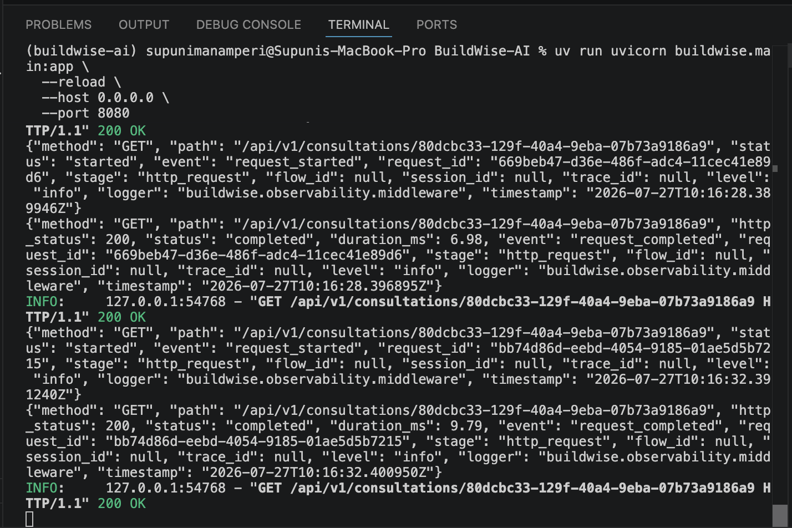

# From Two-Minute Waits to Responsive AI Workflows

## How we reduced both perceived and actual latency in BuildWise AI

AI applications often feel fast in a prototype and painfully slow in a real
workflow.

The difference is rarely one slow model call. It is usually the architecture
around that call: synchronous APIs, repeated generation, validation retries,
and a frontend that cannot explain what is happening.

We encountered exactly this problem while building BuildWise AI, a
multi-stage product-consulting system powered by FastAPI, CrewAI, and
structured OpenAI outputs. A user could submit a product idea, answer
Discovery questions, and eventually receive a detailed product blueprint.
The results were useful, but moving from one stage to the next sometimes took
between 107 and 135 seconds.

This article explains why the original implementation behaved that way and
how we redesigned the workflow to feel responsive while also reducing the
amount of work performed after every clarification.

---

## The original implementation: one request did everything

The first version used a straightforward synchronous request lifecycle.

When a user started a consultation, the frontend called:

```text
POST /api/v1/consultations
```

The backend created a Flow and called `flow.kickoff()` before returning the
HTTP response.

Clarification answers followed the same pattern:

```text
POST /api/v1/consultations/{id}/clarifications
  → validate answers
  → persist answers
  → resume the CrewAI Flow
  → run Discovery again
  → validate the structured output
  → persist the new state
  → finally return the HTTP response
```

The browser remained attached to that request for the entire execution.

This design was simple. The endpoint returned the latest state, and the
frontend did not need a separate job system. But the simplicity came with a
significant user-experience cost.

### A long-running AI workflow looked like a frozen form

During an LLM call, the frontend received no new information. The button
displayed “Continuing…” while the same screen remained visible.

Even when the backend was actively:

- sending a request to OpenAI;
- retrying a transient failure;
- validating a structured response;
- re-running Discovery;
- or persisting a new clarification round,

the user saw no meaningful progress.

The application was working, but it looked stuck.

### Network requests inherited the latency of the entire Flow

An HTTP endpoint is a poor progress indicator for a multi-minute workflow.
Keeping the request open meant that reverse proxies, browsers, and users all
had to tolerate the full Flow duration.

In observed local runs, clarification requests took approximately:

```text
107 seconds
135 seconds
```

Those durations were not caused only by network latency. They represented the
combined cost of model generation, structured-output parsing, guardrail
validation, retries, tracing, and persistence.

### Every clarification regenerated the full Discovery artifact

The largest source of avoidable work was the resume path.

After receiving answers, the system sent the complete product context back to
the Discovery agent and requested another full `DiscoveryResult`. The model
regenerated:

- known facts;
- assumptions;
- unknowns;
- risks;
- interpretations;
- completeness;
- capability classification;
- source metadata;
- and clarification routing.

Most of those sections had already been accepted.

If the user answered a pricing question, there was no reason to regenerate
the product’s known features, risk inventory, source provenance, and
capability classification. Rebuilding the entire artifact consumed more
tokens, increased response time, and created more opportunities for an
otherwise unrelated field to fail validation.

### Validation retries multiplied the delay

BuildWise intentionally uses strict domain validation. For example:

- user-provided facts must reference provenance;
- blocking unknowns cannot allow downstream continuation;
- non-choice questions cannot contain selectable options;
- artifact session IDs must match the active Flow.

These rules protect downstream stages, but an LLM can return a JSON object
that satisfies the visible JSON Schema while violating a cross-field Pydantic
rule.

When that happened, CrewAI retried the task. A successful consultation could
therefore contain several alarming error messages in the middle and take
another full model call before advancing.

### Repeated clarification could become a loop

The state model already defined a maximum of three clarification rounds, but
the Discovery prompt did not know that it had reached the limit.

The model could continue finding useful questions indefinitely, while the
Flow rejected any round above the configured maximum. The limit existed in
code, but it was missing from the decision-making context.

---

## The optimization: separate acknowledgement from execution

The first architectural change was to stop treating a long-running Flow like
a normal request-response operation.

Both mutation endpoints now return:

```text
202 Accepted
```

The new start lifecycle is:

```text
POST /consultations
  → create typed state
  → persist the queued consultation
  → return 202 with the consultation ID
  → run the Flow in the background
```

Clarification submission works similarly:

```text
POST /consultations/{id}/clarifications
  → validate the active round and answers
  → persist the resumable state
  → return 202
  → resume the Flow in the background
```

The important detail is persistence before execution. Once the API says that
the request was accepted, the consultation and its submitted answers already
exist in durable storage.

The current implementation uses FastAPI’s in-process background-task
mechanism. This is appropriate for the present single-service architecture.
A production deployment that requires jobs to survive process termination
could replace this boundary with a durable worker queue without changing the
public API.

---

## Polling turns a black box into visible progress

After receiving `202 Accepted`, the frontend polls:

```text
GET /api/v1/consultations/{id}
```

every four seconds until the consultation:

- requests clarification;
- completes;
- completes with limitations;
- or fails.

The status response now includes an `active_operation` field. Instead of
displaying a generic spinner, the frontend can show messages such as:

- Queued for discovery
- Analyzing product discovery
- Re-evaluating discovery
- Defining product and MVP scope
- Selecting specialists
- Designing solution architecture
- Performing lead review
- Assembling product blueprint

Polling does not make an LLM respond faster, but it changes the experience
from “the form is frozen” to “the consultation is advancing through a known
operation.”

It also removes the entire model-execution duration from the mutation
request. The browser receives acknowledgement quickly and can recover the
latest state after a refresh.

---

## Incremental Discovery: regenerate decisions, not history

The second optimization reduces actual model work.

Initial Discovery still produces the full `DiscoveryResult`. That artifact is
the canonical baseline and contains all accepted facts, risks, provenance,
classification, and interpretations.

After clarification, however, the agent now returns a smaller
`DiscoveryRefinement` containing only:

- remaining unknowns;
- the updated completeness assessment;
- optional next clarification questions;
- the recommended next step;
- limitations;
- and updated confidence.

The prompt explicitly tells the agent not to regenerate:

- known facts;
- risks;
- capability classification;
- interpretations;
- or source metadata.

The application then performs a deterministic merge:

```text
Previous DiscoveryResult
        +
Accumulated clarification context
        +
DiscoveryRefinement
        ↓
Updated canonical DiscoveryResult
```

This keeps stable sections stable. It also ensures that system-owned session
identifiers remain authoritative and that every merged result still passes
the existing `DiscoveryResult` validators.

The improvement is more than token reduction. A smaller output has fewer
fields that can conflict, fewer opportunities for unrelated validation
errors, and a narrower task for the model to reason about.

---

## Clarification now has a visible, enforced boundary

The refinement task receives both:

```text
current clarification round
maximum clarification rounds
```

At the configured limit—three rounds in the current Flow—the prompt states:

- do not request another clarification round;
- return no clarification question set;
- continue with documented assumptions or limitations when responsible;
- otherwise fail Discovery explicitly.

The initial Discovery prompt also states that generated question-set round
numbers must never exceed the limit.

This aligns model behavior with deterministic Flow policy. The model decides
how to interpret unresolved product information, while the application
retains ownership of how many user-interaction cycles are permitted.

---

## Background failures must become state, not silence

Moving execution out of the HTTP request introduces an important failure
mode: an exception can no longer be returned directly as an HTTP 500 response.

Without additional handling, the frontend could poll a consultation that
remains “processing” forever.

The background runner therefore catches execution failures, reconstructs the
latest persisted state, records a normalized `SessionError`, and transitions
the consultation to `failed`.

The polling frontend can then stop and display a terminal failure rather than
spinning indefinitely.

This is a small implementation detail with a large operational effect:
asynchronous work needs an explicit terminal failure state.

---

## Incident: the Business Analyst was executing an internal workflow

After the initial responsiveness changes, one consultation still remained in
the Business Analyst (BA) step for several minutes. This was not ordinary
frontend polling and it was not one slow requirements-generation request.

The captured log showed CrewAI's optional reasoning runtime expanding the BA
task into at least 13 planned substeps. It then performed separate execution
and observation calls for those steps:

```text
Plan
  → Execute step 1
  → Observe step 1
  → Execute step 2
  → Observe step 2
  → ...
```

Examples in the trace included:

- `[Execute] Step 1 ...`
- `[Observe] Step 1 ...`
- execution of steps 1–6, 9, 11, and 13;
- observation failures followed by continued planning;
- repeated attempts to locate a ProductDefinition file in the repository.

The last behavior was especially revealing. BuildWise had already supplied
the canonical `ProductDefinition` through native task context. The internal
plan nevertheless treated the task like an open-ended workspace exercise,
ran exploratory filesystem operations, and expected intermediate JSON files.
Those actions did not contribute to the required
`RequirementsSpecification`.

The supplied excerpt spans approximately 14:21:10 to 14:24:34—more than three
minutes—and was still observing early plan steps. It also contains one call
with 11,504 total tokens and many smaller planning and observation calls.
This was a bounded but highly repetitive workflow, not an infinite loop.

### Why it happened

The BA contract declared:

```text
reasoning = true
max_reasoning_attempts = 3
max_iter = 12
```

In CrewAI 1.15, enabling reasoning can turn one task into a plan,
execute, and observe workflow. The Business Analyst skill supplied detailed
methodology, so the planner decomposed it into many concrete steps.

This mode can be useful for an autonomous agent solving an unfamiliar
workspace problem. It was a poor fit for this boundary because:

- the input was already a typed artifact;
- the output was already a strict Pydantic schema;
- the task had no approved action tools;
- deterministic validators already checked references and completeness;
- intermediate filesystem artifacts were neither required nor consumed.

The reasoning loop multiplied latency, token usage, provider calls, and
failure opportunities without adding a useful application artifact.

### Immediate mitigation

CrewAI reasoning is now a global opt-in:

```env
CREWAI_REASONING_ENABLED=false
MAX_AGENT_ITERATIONS=4
```

The Agent factory enables a contract's reasoning mode only when both the
contract requests it and the global setting explicitly permits it. With the
default configuration:

- BA executes the Requirements task directly;
- specialist and Lead Reviewer tasks also avoid hidden plan/execute/observe
  expansion;
- CrewAI skills remain attached as methodology;
- strict task schemas and domain validators remain active;
- the per-agent iteration ceiling is four instead of twelve.

This is an operational mitigation, not a claim that all reasoning is harmful.
Reasoning may be re-enabled for a deliberately selected task after that task
has a measured latency budget and a plan whose intermediate outputs are
actually used.

---

## Current end-to-end execution path

The current request and execution lifecycle is:

```text
Frontend
  → POST consultation
  → API validation, input guardrail, and durable queued state
  → 202 Accepted
  → background CrewAI Flow
      → Discovery Crew
      → optional clarification pause/refinement
      → Product Planning Crew
          → Product Manager
          → Business Analyst
          → optional Market & GTM Strategist
      → deterministic Specialist Planner
      → Technical Planning Crew
          → Solution Architect
          → optional AI Architect
          → optional Security Architect
          → optional QA and Evaluation Architect
      → deterministic Project Cost Aggregator
      → Lead Review Crew
      → optional bounded targeted revision
      → deterministic pre-assembly validation
      → deterministic blueprint assembly and Markdown rendering
      → post-assembly validation
      → filesystem or S3 report storage
  → frontend polling, result display, and Markdown download
```

The frontend status poll runs every four seconds. Those repeated
`GET /consultations/{id}` entries are expected polling traffic; they do not
restart the Crew and are not agent iterations.

The Flow now explicitly checkpoints a stage before each long Crew call. This
lets the status endpoint show Discovery, Product Planning, Technical
Planning, and Lead Review while those operations are running instead of
displaying the previous completed stage.

### Expected first-pass model tasks

With reasoning disabled and no retries, a first-pass consultation performs:

| Stage | Model-backed tasks | Execution mode |
|---|---:|---|
| Initial Discovery | 1 | Direct structured task |
| Clarification refinement | 0 or 1 per round | Compact structured task |
| Product Planning | 2, or 3 with Market & GTM | Sequential |
| Specialist planning | 0 | Deterministic Python |
| Technical Planning | 1–4 | Sequential, based on selection |
| Project cost aggregation | 0 | Deterministic Python |
| Lead Review | 1 | Direct structured task |
| Blueprint assembly and validation | 0 | Deterministic Python |

This means a consultation without clarification, Market & GTM, optional
technical specialists, or revisions has five primary model-backed tasks:
Discovery, Product Definition, Requirements, Solution Architecture, and Lead
Review—five tasks in total. With every optional first-pass task selected, the
total is nine.

Clarification and Lead Review revisions add work by policy:

- clarification is limited to three rounds;
- specialist revisions are limited to two;
- technical revision cascades rerun only the target and selected downstream
  dependants;
- no additional Agent plans revision routing.

### Current iteration and retry boundaries

The relevant limits are intentionally separate:

| Boundary | Current value | Effect |
|---|---:|---|
| Agent iterations | 4 | Maximum internal Agent turns per task |
| Agent task retries | 0 | Do not regenerate a full task after provider-side parsing failure |
| CrewAI reasoning | Disabled | Prevents automatic plan/execute/observe expansion |
| Provider retries | 2 | Up to two provider retry attempts after the initial request |
| Task guardrail retries | 2 | Bounded correction attempts after guardrail rejection |
| Provider request timeout | 240 seconds | Maximum wait for one provider request |
| Agent execution timeout | 900 seconds | Maximum execution time assigned to an Agent |
| Clarification rounds | 3 | Maximum human Discovery refinement rounds |
| Specialist revisions | 2 | Maximum targeted review revision cycles |
| Session Agent executions | 20 | Runtime-budget ceiling |
| Session tokens | 120,000 | Runtime-budget ceiling |

These values are ceilings, not expected counts. In a healthy direct
structured task, the Agent should normally complete in one iteration. A
240-second provider timeout prevents premature failure for large structured
outputs, but it can make the worst-case failure path longer; increasing it
does not improve normal latency.

---

## How latency accumulates now

For a normal run, total generation latency is approximately the sum of
sequential model tasks:

```text
Discovery
+ Product Definition
+ Requirements
+ optional Market & GTM
+ selected technical specialists
+ Lead Review
+ any correction or provider retries
```

The current Product Planning and Technical Planning Crews are sequential
because later artifacts contain validated references to earlier artifacts.
For example, Requirements references the Product Definition, while Security
and QA may depend on Solution and AI decisions. This preserves consistency
but means the stage duration is additive.

The largest remaining latency contributors are:

1. Large structured-output schemas and responses.
2. Sequential dependency chains.
3. Provider response time, especially for architecture models.
4. Provider and guardrail retries.
5. Optional Market, AI, Security, and QA selection.
6. Targeted revision cycles after Lead Review.

Database polling is not a material compute contributor: observed status reads
normally complete in roughly 6–14 milliseconds. Verbose console rendering
makes logs noisy, but the incident's major delay came from extra model calls,
not from those GET requests.

---

## What has been changed so far

The latency and reliability work currently includes:

- `202 Accepted` mutation endpoints with background execution;
- four-second frontend polling with active-operation text;
- explicit pre-Crew stage checkpoints for timely progress display;
- compact `DiscoveryRefinement` instead of full Discovery regeneration;
- deterministic refinement-route normalization before provider-side Pydantic
  validation;
- explicit UUID and cross-reference instructions for Product Definition;
- non-null HTTP trace IDs for log correlation;
- a 240-second configurable provider timeout;
- CrewAI reasoning disabled by default;
- a four-iteration global Agent ceiling;
- bounded clarification, revision, provider retry, and guardrail retry paths;
- persisted terminal failures so the frontend cannot poll forever.

The timeout increase is a reliability measure rather than a speed
optimization. The reasoning change is the main fix for the BA incident
because it removes unnecessary model calls instead of allowing them more time.

---

## What we should measure next

The next optimization should be driven by stage-level measurements rather
than another blanket timeout change. For every model-backed task, capture:

- queue-to-start delay;
- provider request duration;
- validation and repair duration;
- task and Crew duration;
- input, output, cached, and reasoning tokens;
- Agent iteration count;
- provider retry count;
- guardrail retry count;
- selected model and specialist;
- success or normalized failure category.

Useful operational targets are:

- p50 and p95 latency per task and Flow stage;
- model calls per completed consultation;
- tokens per accepted artifact;
- percentage of tasks completing in one Agent iteration;
- provider and guardrail retry rates;
- clarification and revision frequency;
- time to first visible stage update;
- total time to blueprint.

Likely follow-up improvements include compact context projections for each
specialist, parallel execution only for genuinely independent specialists,
smaller schema-owned outputs with deterministic assembly, and durable worker
execution. Those changes should be evaluated against reference integrity and
blueprint quality, not latency alone.

---

## Before and after

| Concern | Earlier implementation | Current implementation |
|---|---|---|
| Mutation response | Returned after Flow execution | Returns `202 Accepted` after persistence |
| Frontend feedback | One long loading state | Polling with stage checkpoints and active-operation messages |
| Clarification processing | Regenerated full Discovery | Generates and deterministically merges a compact refinement |
| Stable Discovery sections | Rewritten by the LLM | Preserved deterministically |
| Clarification limit | Enforced only by state validation | Included in prompt and state policy; maximum three |
| BA execution | 13-step plan/execute/observe workflow observed | Direct structured task; reasoning disabled by default |
| Agent iteration ceiling | Up to 12 for BA | Global maximum four |
| Background failure | Could be invisible after response | Persisted as terminal failed state |
| HTTP correlation | Trace ID could be null | Generated or caller-supplied trace ID |
| Refresh recovery | Depended on completed request | Reads latest persisted consultation |

---

## What this optimization does—and does not—solve

The redesign dramatically improves perceived responsiveness and reduces
clarification-time generation work.

It does not make every planning stage instantaneous. Product definition,
requirements, architecture, and lead review still involve substantial model
work. Their actual duration depends on provider response time, model choice,
output size, retries, and rate limits.

It also does not turn in-process background execution into a distributed job
system. If BuildWise is deployed across multiple instances or must guarantee
execution through server restarts, the next step is a durable queue with
worker ownership, leases, retry policy, and idempotency.

But the API and frontend no longer assume that work finishes inside one HTTP
request. That separation is the important foundation.

---

## The broader lesson

Latency in an AI product is not only a model-performance problem.

It is also an orchestration problem, a state-management problem, and a
communication problem.

The most effective changes in BuildWise came from asking three questions:

1. Does the user need the result now, or only confirmation that work started?
2. Are we regenerating information that has already been accepted?
3. Can the interface explain the operation currently in progress?

By returning early, polling durable state, narrowing the LLM’s refinement
task, and making workflow limits explicit, we transformed a two-minute frozen
request into a responsive, observable consultation.

The models still need time to think. The application no longer makes the user
wait in the dark.




