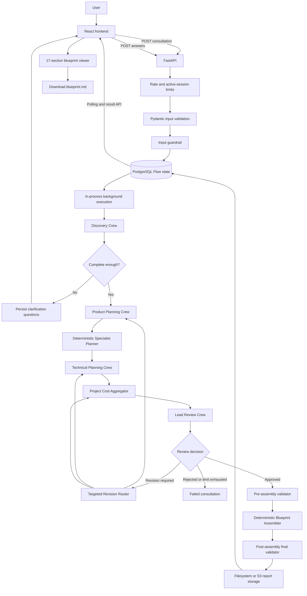

# BuildWise AI — Current End-to-End Implementation Flow

This document describes the system that is implemented today, beginning in
the browser frontend and ending with blueprint display and Markdown download.
It is an implementation guide, not a proposed architecture.

## 1. Runtime overview



The backend uses one typed `BuildWiseFlowState` as the canonical lifecycle
state. CrewAI Flow routing controls execution, while PostgreSQL checkpoints
state and versioned artifacts after Flow mutations.

## 2. Frontend intake

The current frontend is implemented in `web/app/page.tsx`.

The user can enter:

- Product title and idea
- Target users
- Known features
- Target platform
- Delivery expectation
- Preferred timeline
- Estimated budget
- Whether AI capabilities are requested
- Whether sensitive data is handled

The frontend converts comma-separated user and feature fields into arrays and
sends:

```http
POST /api/v1/consultations
Content-Type: application/json
```

The request body maps to `StartConsultationRequest`, which extends the domain
`ProductIdeaRequest`.

The API base URL is selected in this order:

1. The value saved under `buildwise-api` in browser `localStorage`
2. `NEXT_PUBLIC_BUILDWISE_API_URL`
3. `http://localhost:8080/api/v1`

After a consultation is accepted, the frontend stores its public identifier
under `buildwise-consultation`. On a refresh, it uses that identifier to
reconstruct the current screen from the backend.

## 3. API admission boundary

Before a consultation is persisted or passed to a model, the request crosses
these boundaries:

1. `ConsultationRateLimitMiddleware` applies a process-local per-client limit
   to consultation and clarification POST requests.
2. FastAPI and Pydantic validate field types, lengths, enums, and cross-field
   constraints.
3. `InputGuardrailProcessor` scans all submitted strings for high-confidence
   prompt-injection and credential patterns.
4. `ConsultationService` reserves capacity against
   `MAX_ACTIVE_CONSULTATIONS`.

Rejected prompt injection or credential material receives
`INPUT_GUARDRAIL_REJECTED`. Exhausted request or execution capacity receives
HTTP `429` with `CAPACITY_LIMIT_EXCEEDED`.

The MVP limiter and active-execution registry are process-local. A deployment
with multiple workers or application replicas needs a shared limiter and work
coordinator, such as an API gateway and Redis-backed capacity tracking.

## 4. Consultation creation and initial persistence

`ConsultationService.enqueue_start()`:

1. Runs the input guardrail.
2. Creates `BuildWiseFlowState` with a generated `session_id` and the intake
   request.
3. Reserves an execution slot.
4. Persists the initial state through `BuildWiseFlowStore`.
5. Returns HTTP `202` with status `created`, stage `intake`, and active
   operation `Queued for discovery`.

The FastAPI endpoint schedules `ConsultationService.run()` as an in-process
background task. The HTTP request does not wait for all Crew executions.

`BuildWiseFlowStore` writes the state into PostgreSQL and keeps the CrewAI
Flow UUID as internal persistence metadata. Its persistence path covers:

- `consultations`
- Versioned `artifacts`
- `clarification_rounds`
- `revisions`
- `usage`
- `blueprint_reports`

## 5. Frontend polling

While a consultation is active, the frontend requests:

```http
GET /api/v1/consultations/{consultation_id}
```

Polling occurs every four seconds and stops when the status becomes:

- `awaiting_user_input`
- `completed`
- `completed_with_limitations`
- `failed`

The response contains the current status, stage, clarification round,
questions when applicable, and a user-facing `active_operation`.

If persisted state says execution is active but the process-local execution
registry no longer contains the consultation, the service treats the work as
interrupted by a restart and marks it failed. Automatic distributed job
recovery is not currently implemented.

## 6. Flow initialization

`BuildWiseConsultingFlow.initialize()` accepts only:

- A new state with status `created`
- A resumed state with status `resuming`

Both routes enter Discovery. Any other entry state is rejected.

All Crew calls pass through the Flow's `_kickoff()` boundary. Before execution,
`RuntimeBudgetController` checks agent-execution capacity. After execution,
the usage aggregator records:

- Input, output, and total tokens
- Successful provider requests
- Number of Crew agents executed
- Execution duration
- Provider/model/cost metadata when reliably available

The controller then enforces:

- `MAX_SESSION_TOKENS`
- `MAX_ESTIMATED_COST_USD`, when complete reliable cost metadata exists
- `MAX_AGENT_EXECUTIONS`
- `MAX_TOOL_CALLS`
- `MAX_EXECUTION_SECONDS`

## 7. Discovery and clarification loop

The Discovery Crew receives:

- The intake request
- Existing clarification context, if any
- The previous Discovery result, when resuming
- The maximum clarification-round limit

It produces either a full `DiscoveryResult` or a refinement that is merged
into the previous result. The result contains the product context,
completeness decision, capability classification, assumptions, unknowns,
risks, limitations, and optional clarification questions.

The deterministic discovery router chooses one of three outcomes:

- Continue to Product Planning
- Request clarification
- Fail because the workflow cannot continue safely

When clarification is required, the Flow:

1. Moves to `clarification` / `awaiting_user_input`.
2. Persists the typed `ClarificationQuestionSet`.
3. Ends that background execution.
4. Exposes the active questions through the status endpoint.

The frontend supports:

- Free text
- Integer and decimal numbers
- Boolean answers
- Single choice
- Multiple choice

It submits:

```http
POST /api/v1/consultations/{consultation_id}/clarifications
```

The payload includes the active `clarification_round`, question IDs, and
answers. The service:

1. Screens the answers through the input guardrail.
2. Reloads typed state from PostgreSQL.
3. Confirms the session is awaiting input.
4. Confirms the submitted round is current.
5. Validates answers against the active question set.
6. Persists the accepted answers and changes status to `resuming`.
7. Schedules another background Flow execution.

Discovery then runs again with the accumulated answer context. The loop is
bounded by `maximum_clarification_rounds`.

## 8. Product Planning

After Discovery is complete, the deterministic early-market policy decides
whether Market & GTM context is needed.

The Product Planning Crew contains:

- Product Manager
- Business Analyst
- Market & GTM Strategist when selected by the early-market policy

It produces `ProductPlanningResult`, containing:

- `ProductDefinition`
- `RequirementsSpecification`
- Optional `MarketAndGTMStrategy`

The assembler binds all artifacts to the current consultation and validates
their ownership and cross-artifact references.

## 9. Deterministic specialist planning

`SpecialistPlanner` is Python logic, not an Agent or Crew.

It consumes Discovery, Product Planning, and `FlowRuntimeLimits`, then creates
the exact `SpecialistExecutionPlan` used by Technical Planning.

Selection rules are:

- Solution Architecture is required.
- AI Architecture is conditional.
- Security Architecture is conditional.
- QA and Evaluation is conditional.
- Market & GTM is not part of the technical specialist plan because its
  decision occurs earlier.

The plan includes selection rationales, dependencies, and execution groups.
Optional specialists may be trimmed deterministically when planning limits
cannot support all requested work. Safety-critical work is not silently
removed.

## 10. Technical Planning

The Technical Planning Crew executes the selected specialists sequentially:

1. Solution Architect
2. AI Architect, when selected
3. Security Architect, when selected
4. QA and Evaluation Architect, when selected

The assembled `TechnicalPlanningResult` always requires
`SolutionArchitecture`. Optional results are included only when produced.

If a selected optional AI, Security, or QA result is unavailable, the Flow:

- Marks that specialist execution failed
- Adds a safe normalized error and warning
- Continues toward Lead Review
- Adds an explicit unavailable-analysis disclosure to the corresponding
  blueprint section and the final limitations

A missing Solution Architecture remains fatal.

## 11. Tools and external content

Agents receive tools only through the default-deny `ToolRegistry`. The current
keys are:

- `web_search`
- `web_scraper`
- `github_search`

Each resolved tool is wrapped by a governed `SanitizedTool` proxy. Before
external output can enter agent context, the proxy applies:

- Input-size limits
- HTTPS and optional domain rules
- Read-only side-effect classification
- Per-tool timeout
- Bounded retry policy
- Session tool-call and retry accounting
- Prompt-injection line removal
- Credential redaction
- Output normalization and truncation
- An explicit untrusted-data header

Tool failures expose a safe category instead of raw provider content.

## 12. Project cost aggregation

After Technical Planning, `ProjectCostAggregator` gathers implementation-cost
estimates from:

- Product Definition
- Optional Market & GTM
- Solution Architecture
- Optional AI Architecture
- Optional Security Architecture
- Optional QA and Evaluation

Point estimates become equal minimum/expected/maximum values. Totals combine
only estimates with the same currency and frequency. The aggregator does not
invent exchange rates or annualize incompatible values.

This project cost is separate from the LLM execution usage and cost stored in
`UsageSummary`.

## 13. Lead Review and targeted revisions

The Lead Review Crew receives all current approved planning artifacts, project
costs, the specialist plan, and revision history.

Its `LeadReview` decision routes deterministically:

| Decision | Route |
|---|---|
| `approved` | Assemble blueprint |
| `approved_with_limitations` | Assemble blueprint and retain limitations |
| `revision_required` | Run targeted revision |
| `rejected` | Fail the consultation |

The targeted revision router does not use another Agent. It maps:

- Product Definition, Requirements, and Market & GTM revisions to the Product
  Planning Crew
- Solution, AI, Security, and QA revisions to the Technical Planning Crew
- Cost-only revisions to deterministic cost re-aggregation

Technical dependency cascades are:

- Solution → Solution plus selected AI, Security, and QA
- AI → AI plus selected Security and QA
- Security → Security plus selected QA
- QA → QA only

The revision count is bounded by
`state.limits.maximum_specialist_revisions`. Each revision returns to Lead
Review; exceeding the limit routes to failure.

## 14. Blueprint validation and assembly

An approved review crosses two validation boundaries.

### Pre-assembly validation

`validate_output(state)` checks:

- Required stage artifacts exist
- Artifact session ownership
- Product, requirement, and architecture ownership relationships
- Specialist execution-graph consistency
- Technical output consistency after any optional failures
- Project cost freshness
- Lead Review decision consistency
- No blocking revisions remain

### Deterministic assembly

`BlueprintAssembler` builds the typed `ProductBlueprint` and all 17 canonical
sections:

1. Executive Summary
2. Product Vision
3. Users and Personas
4. Features and MVP Scope
5. Requirements
6. User Journeys
7. Market and GTM
8. Solution Architecture
9. AI Architecture
10. Security Architecture
11. QA and Evaluation
12. Roadmap
13. Costs
14. Risks and Assumptions
15. Open Questions
16. Implementation Guidance
17. Limitations

It also aggregates implementation phases, risks, assumptions,
recommendations, open questions, limitations, and usage. Markdown rendering
is deterministic and does not invoke an LLM.

### Post-assembly validation

`validate_final_output(blueprint)` checks the actual typed blueprint and
generated Markdown for:

- Complete, unique, canonically ordered sections
- Nonblank titles, summaries, and Markdown
- Correct rendered section headings
- Unresolved placeholders
- Structurally valid HTTP(S) references
- Project-cost estimate disclosure
- Rendered risks, assumptions, open questions, phases, and limitations
- Consistent usage totals
- Exact agreement between the blueprint and regenerated Markdown

Storage and completion occur only after this validator passes.

## 15. Report storage and final persistence

The configured report backend is selected through
`REPORT_STORAGE_BACKEND`.

### Local filesystem

```text
data/reports/{consultation_id}/blueprint.md
```

Optional JSON:

```text
data/reports/{consultation_id}/blueprint.json
```

### S3

```text
consultations/{consultation_id}/blueprints/v1/blueprint.md
```

Optional JSON:

```text
consultations/{consultation_id}/blueprints/v1/blueprint.json
```

Only version `1` is implemented. PostgreSQL stores:

- `consultation_id`
- `blueprint_version`
- `s3_key`, which also contains the local path for filesystem storage
- `generated_at`
- `lead_review_id`

After report storage succeeds, the state is marked `completed` or
`completed_with_limitations` and the final blueprint artifact is checkpointed.

## 16. Result delivery to the frontend

When polling observes a completed status, the frontend requests:

```http
GET /api/v1/consultations/{consultation_id}/result
```

The endpoint returns the typed `ProductBlueprint` only for completed states.
Before completion it returns a conflict response.

The frontend renders:

- Blueprint version and title
- Executive summary
- Navigation for all sections
- Section summaries and Markdown-derived content
- Counts for open questions and limitations
- Lead Review approval state

The Download button creates a browser `Blob` from
`blueprint.generated_markdown` and downloads `blueprint.md`. The browser does
not fetch the S3 object directly.

## 17. Failure behavior

Background exceptions are passed through `normalize_session_error()`.
Recognized budget, tool, timeout, invalid-output, and unknown failures become
stable `SessionError` records without persisting raw exception messages or
secrets.

A failed state is persisted and exposed through the status endpoint. The
frontend stops polling and offers the user a new consultation.

The current frontend request helper primarily reads FastAPI's `detail` field.
Some newer normalized errors use a top-level `message`, so those responses can
currently fall back to a generic `Request failed (<status>)` frontend message.
This is a presentation mismatch, not a backend lifecycle failure.

## 18. Current deployment boundaries

The current implementation intentionally has these MVP boundaries:

- No user authentication or tenant isolation
- Background execution uses FastAPI in-process tasks, not a durable job queue
- Active-session and request-rate limits are process-local
- In-flight processing is marked failed after a process restart
- S3 is optional for local development
- Blueprint version comparison and update workflows are not implemented
- Provider/model fallback is not implemented
- Dollar cost remains `null` when reliable provider metadata is unavailable
- Tools are read-only and must be resolved through `ToolRegistry`

These boundaries should be considered before enabling multiple API workers or
exposing the service directly to public internet traffic.

## 19. Primary implementation map

| Responsibility | Current implementation |
|---|---|
| Frontend intake, polling, clarification, viewer | `web/app/page.tsx` |
| HTTP consultation endpoints | `src/buildwise/api/v1/consultations.py` |
| Session/background service | `src/buildwise/api/v1/consultation_service.py` |
| API rate limiting | `src/buildwise/api/rate_limiter.py` |
| Input guardrail | `src/buildwise/application/input_guardrail.py` |
| Main CrewAI Flow | `src/buildwise/flows/consulting_flow.py` |
| Typed Flow state and limits | `src/buildwise/flows/state.py` |
| Discovery routing | `src/buildwise/flows/routing.py` |
| Specialist planning | `src/buildwise/planning/` |
| Targeted revision routing | `src/buildwise/flows/revisions.py` |
| Runtime budgets | `src/buildwise/application/runtime_budget.py` |
| LLM usage aggregation | `src/buildwise/application/usage_aggregator.py` |
| Project cost aggregation | `src/buildwise/application/cost_aggregator.py` |
| Tool registry and policies | `src/buildwise/tools/registry.py`, `policies.py` |
| Tool governance and sanitization | `src/buildwise/tools/sanitizer.py` |
| Pre-assembly validation | `src/buildwise/validation/output_validator.py` |
| Blueprint assembly and Markdown | `src/buildwise/reporting/assembler.py`, `markdown_renderer.py` |
| Post-assembly validation | `src/buildwise/validation/final_output_validator.py` |
| Report storage | `src/buildwise/reporting/storage.py` |
| PostgreSQL persistence | `src/buildwise/persistence/` |
| Error normalization | `src/buildwise/application/error_normalizer.py` |
